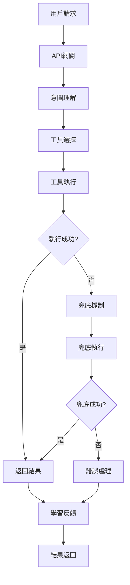

# PowerAutomation 系統架構總覽

PowerAutomation是一個基於MCP（Model Context Protocol）的智能工具自動化平台，採用分層架構設計，提供高度可擴展和智能化的解決方案。

## 🏗️ 整體架構

```
┌─────────────────────────────────────────────────────────────┐
│                    用戶界面層 (UI Layer)                      │
├─────────────────────────────────────────────────────────────┤
│                    API網關層 (API Gateway)                   │
├─────────────────────────────────────────────────────────────┤
│                  業務邏輯層 (Business Logic)                  │
│  ┌─────────────┐ ┌─────────────┐ ┌─────────────┐ ┌─────────┐ │
│  │ 工具選擇器   │ │ 意圖處理器   │ │ 兜底機制     │ │ 學習系統 │ │
│  └─────────────┘ └─────────────┘ └─────────────┘ └─────────┘ │
├─────────────────────────────────────────────────────────────┤
│                   MCP適配器層 (MCP Adapters)                 │
│  ┌─────────────┐ ┌─────────────┐ ┌─────────────┐ ┌─────────┐ │
│  │ 內建工具     │ │ 外部服務     │ │ AI模型      │ │ 自定義工具│ │
│  └─────────────┘ └─────────────┘ └─────────────┘ └─────────┘ │
├─────────────────────────────────────────────────────────────┤
│                   基礎設施層 (Infrastructure)                │
│  ┌─────────────┐ ┌─────────────┐ ┌─────────────┐ ┌─────────┐ │
│  │ 配置管理     │ │ 日誌系統     │ │ 監控告警     │ │ 安全認證 │ │
│  └─────────────┘ └─────────────┘ └─────────────┘ └─────────┘ │
└─────────────────────────────────────────────────────────────┘
```

## 🎯 核心組件

### 1. 智能工具選擇器 (Enhanced Tool Selector)

**功能**: 基於問題類型和上下文智能選擇最適合的工具

**特性**:
- 多維度問題分析
- 動態信心度計算
- 性能矩陣優化
- 實時學習調整

**架構**:
```python
class EnhancedToolSelectorV4:
    def __init__(self):
        self.performance_matrix = {...}
        self.question_classifier = QuestionClassifier()
        self.confidence_calculator = ConfidenceCalculator()
    
    def select_tools(self, question: str) -> ToolSelection:
        question_type = self.classify_question(question)
        tools = self.rank_tools(question_type)
        return self.calculate_confidence(tools, question)
```

### 2. 智能兜底機制 (Enhanced Fallback System)

**功能**: 當主要工具失敗時，提供智能的備用解決方案

**特性**:
- 三層兜底策略
- 外部服務集成
- 動態工具發現
- 學習型優化

**兜底層級**:
1. **內部工具兜底**: 使用其他內建工具
2. **外部服務兜底**: 調用外部API服務
3. **AI模型兜底**: 使用大語言模型

### 3. 意圖理解處理器 (Intent Understanding Processor)

**功能**: 深度理解用戶意圖，提供精準的問題分析

**特性**:
- 自然語言處理
- 上下文理解
- 意圖分類
- 實體識別

### 4. 學習反饋系統 (Learning Feedback System)

**功能**: 基於使用反饋持續優化系統性能

**特性**:
- 成功率統計
- 性能指標收集
- 自動調優
- 知識庫更新

## 🔄 數據流架構

### 請求處理流程



### 數據存儲架構

```
┌─────────────────────────────────────────────────────────────┐
│                        數據層 (Data Layer)                   │
├─────────────────────────────────────────────────────────────┤
│  ┌─────────────┐ ┌─────────────┐ ┌─────────────┐ ┌─────────┐ │
│  │ 配置數據     │ │ 用戶數據     │ │ 日誌數據     │ │ 緩存數據 │ │
│  │ (JSON/YAML) │ │ (SQLite)    │ │ (Files)     │ │ (Memory)│ │
│  └─────────────┘ └─────────────┘ └─────────────┘ └─────────┘ │
├─────────────────────────────────────────────────────────────┤
│  ┌─────────────┐ ┌─────────────┐ ┌─────────────┐ ┌─────────┐ │
│  │ 工具註冊表   │ │ 性能指標     │ │ 學習數據     │ │ 模型數據 │ │
│  │ (Registry)  │ │ (Metrics)   │ │ (Learning)  │ │ (Models)│ │
│  └─────────────┘ └─────────────┘ └─────────────┘ └─────────┘ │
└─────────────────────────────────────────────────────────────┘
```

## 🧩 MCP適配器架構

### 適配器類型

1. **內建適配器**
   - Sequential Thinking
   - WebAgent
   - Code Execution
   - File Operations

2. **AI模型適配器**
   - Gemini
   - Claude
   - GPT-4
   - 本地模型

3. **外部服務適配器**
   - Zapier
   - GitHub
   - Slack
   - 自定義API

4. **專業工具適配器**
   - ArXiv搜索
   - 數學計算
   - 圖像處理
   - 數據分析

### 適配器接口

```python
class BaseMCPAdapter:
    def __init__(self, config: Dict[str, Any]):
        self.config = config
        self.client = None
    
    async def connect(self) -> bool:
        """建立連接"""
        pass
    
    async def execute_tool(self, tool_name: str, args: Dict) -> Any:
        """執行工具"""
        pass
    
    async def list_tools(self) -> List[Tool]:
        """列出可用工具"""
        pass
    
    async def disconnect(self):
        """斷開連接"""
        pass
```

## 🔧 配置管理架構

### 配置層級

1. **系統配置**: 核心系統參數
2. **適配器配置**: 各適配器的配置
3. **用戶配置**: 用戶個性化設置
4. **環境配置**: 不同環境的配置

### 配置格式

```yaml
# config/system.yaml
system:
  version: "1.0.0"
  debug: false
  timeout: 30

adapters:
  gemini:
    api_key: "${GEMINI_API_KEY}"
    model: "gemini-pro"
    timeout: 30
  
  claude:
    api_key: "${CLAUDE_API_KEY}"
    model: "claude-3-sonnet"
    timeout: 30

quality_gates:
  min_success_rate: 90.0
  min_confidence: 80.0
  max_execution_time: 300.0
```

## 📊 監控和可觀測性

### 監控指標

1. **性能指標**
   - 響應時間
   - 吞吐量
   - 錯誤率
   - 資源使用率

2. **業務指標**
   - 成功率
   - 工具使用分佈
   - 用戶滿意度
   - 兜底觸發率

3. **系統指標**
   - CPU使用率
   - 內存使用率
   - 磁盤I/O
   - 網絡延遲

### 日誌架構

```
┌─────────────────────────────────────────────────────────────┐
│                      日誌系統 (Logging)                      │
├─────────────────────────────────────────────────────────────┤
│  ┌─────────────┐ ┌─────────────┐ ┌─────────────┐ ┌─────────┐ │
│  │ 應用日誌     │ │ 訪問日誌     │ │ 錯誤日誌     │ │ 審計日誌 │ │
│  │ (App Logs)  │ │ (Access)    │ │ (Error)     │ │ (Audit) │ │
│  └─────────────┘ └─────────────┘ └─────────────┘ └─────────┘ │
├─────────────────────────────────────────────────────────────┤
│  ┌─────────────┐ ┌─────────────┐ ┌─────────────┐ ┌─────────┐ │
│  │ 結構化日誌   │ │ 日誌聚合     │ │ 日誌分析     │ │ 告警系統 │ │
│  │ (Structured)│ │ (Aggregation│ │ (Analysis)  │ │ (Alert) │ │
│  └─────────────┘ └─────────────┘ └─────────────┘ └─────────┘ │
└─────────────────────────────────────────────────────────────┘
```

## 🔒 安全架構

### 安全層級

1. **網絡安全**
   - HTTPS/TLS加密
   - API限流
   - 防火牆配置
   - DDoS防護

2. **身份認證**
   - API密鑰管理
   - OAuth 2.0
   - JWT令牌
   - 多因素認證

3. **數據安全**
   - 數據加密
   - 敏感信息脫敏
   - 訪問控制
   - 數據備份

4. **代碼安全**
   - 靜態代碼分析
   - 依賴安全掃描
   - 漏洞檢測
   - 安全審計

## 🚀 部署架構

### 部署模式

1. **單機部署**
   - 適用於開發和測試
   - 簡單配置
   - 快速啟動

2. **容器化部署**
   - Docker容器
   - 環境隔離
   - 易於擴展

3. **微服務部署**
   - Kubernetes編排
   - 服務發現
   - 負載均衡

4. **雲原生部署**
   - 雲服務集成
   - 自動擴縮容
   - 高可用性

### 部署拓撲

```
┌─────────────────────────────────────────────────────────────┐
│                      負載均衡器 (Load Balancer)               │
├─────────────────────────────────────────────────────────────┤
│  ┌─────────────┐ ┌─────────────┐ ┌─────────────┐ ┌─────────┐ │
│  │ API網關實例1 │ │ API網關實例2 │ │ API網關實例3 │ │   ...   │ │
│  └─────────────┘ └─────────────┘ └─────────────┘ └─────────┘ │
├─────────────────────────────────────────────────────────────┤
│  ┌─────────────┐ ┌─────────────┐ ┌─────────────┐ ┌─────────┐ │
│  │ 業務服務實例1│ │ 業務服務實例2│ │ 業務服務實例3│ │   ...   │ │
│  └─────────────┘ └─────────────┘ └─────────────┘ └─────────┘ │
├─────────────────────────────────────────────────────────────┤
│  ┌─────────────┐ ┌─────────────┐ ┌─────────────┐ ┌─────────┐ │
│  │ 數據庫集群   │ │ 緩存集群     │ │ 消息隊列     │ │ 存儲系統 │ │
│  └─────────────┘ └─────────────┘ └─────────────┘ └─────────┘ │
└─────────────────────────────────────────────────────────────┘
```

## 📈 擴展性設計

### 水平擴展

- 無狀態服務設計
- 負載均衡
- 數據庫分片
- 緩存分佈

### 垂直擴展

- 資源動態調整
- 性能優化
- 算法改進
- 硬件升級

### 功能擴展

- 插件化架構
- 模塊化設計
- API擴展
- 自定義適配器

## 🔄 持續集成/持續部署 (CI/CD)

### CI/CD流水線

```
代碼提交 → 自動測試 → 代碼審查 → 構建打包 → 部署測試 → 生產發布
    ↓         ↓         ↓         ↓         ↓         ↓
  Git Push  十層級測試  PR Review  Docker    Staging   Production
            GAIA測試   安全掃描    Build     Deploy    Deploy
            性能測試   質量檢查    Push      Verify    Monitor
```

### 質量保證

- 自動化測試覆蓋率 ≥95%
- GAIA基準測試通過率 ≥90%
- 安全掃描無高危漏洞
- 性能指標符合要求

## 🎯 架構優勢

### 1. 高可靠性
- 多層兜底機制
- 故障自動恢復
- 服務降級策略
- 數據一致性保證

### 2. 高性能
- 智能緩存策略
- 並行處理能力
- 資源優化使用
- 響應時間優化

### 3. 高可擴展性
- 微服務架構
- 插件化設計
- 水平擴展能力
- 模塊化組件

### 4. 高可維護性
- 清晰的分層架構
- 標準化接口
- 完善的文檔
- 自動化運維

## 🔮 未來發展

### 技術演進
- AI能力增強
- 邊緣計算支持
- 實時流處理
- 圖計算能力

### 生態擴展
- 更多MCP適配器
- 社區插件市場
- 第三方集成
- 行業解決方案

### 性能優化
- 算法優化
- 硬件加速
- 分佈式計算
- 智能調度

